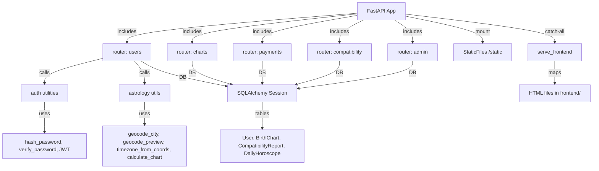

# Zodovia Audit Report

## 1️⃣ Project Overview
Zodovia is a FastAPI‑based backend serving a set of static HTML pages (frontend). The backend lives under `backend/` and uses SQLAlchemy for data persistence. The frontend consists of plain HTML/CSS/JS files under `frontend/`.

## 2️⃣ Connection Map


## 3️⃣ Function & Module Index
| Module / File | Exported Functions / Classes | Purpose |
|---|---|---|
| `backend/main.py` | `lifespan`, FastAPI app instance | App bootstrap, DB migrations, superuser seed |
| `backend/auth.py` | `hash_password`, `verify_password`, `create_access_token`, `get_current_user` | Password hashing, JWT handling |
| `backend/database.py` | `engine`, `Base`, `SessionLocal`, `get_db` | SQLAlchemy engine & session factory |
| `backend/models.py` | `User`, `BirthChart`, `CompatibilityReport`, `DailyHoroscope` | ORM table definitions |
| `backend/schemas.py` | Pydantic models (`UserRegister`, `UserLogin`, `TokenResponse`, etc.) | Request/response validation |
| `backend/astrology.py` | `geocode_city`, `geocode_preview`, `timezone_from_coords`, `calculate_chart` | External geocoding & chart calculation |
| `backend/routers/users.py` | `register`, `login`, `get_me`, `geocode_city_preview`, `submit_birth_data` | User auth & birth‑data handling |
| `backend/routers/admin.py` | `_require_superuser`, `_format_dt`, `_user_to_summary`, `list_users`, `get_user_detail`, `get_stats` | Admin‑only user management & stats |
| `backend/routers/charts.py` | `my_chart`, `ask_stars`, `horoscope_today` | Chart retrieval & AI‑driven queries |
| `backend/routers/payments.py` | `checkout_url`, `webhook` | Payment integration (Paddle) |
| `backend/routers/compatibility.py` | `create_compatibility_report` (implicit) | Compatibility report generation |
| `frontend/static/css/style.css` | CSS rules | Layout & visual styling |
| `frontend/*.html` | Static pages (`index.html`, `chart.html`, …) | UI entry points |

## 4️⃣ UX Evaluation (Frontend)
| Aspect | Observation | Impact |
|---|---|---|
| **Responsive Design** | No media queries or flex/grid layout in `style.css`; pages are fixed‑width. | Poor mobile experience. |
| **Accessibility** | Minimal ARIA attributes; images lack `alt` text; form fields not labelled. | Users with assistive tech may struggle. |
| **Navigation** | Simple server‑side routing via catch‑all; no client‑side navigation. | Full page reloads on each navigation; slower UX. |
| **Visual Design** | Plain HTML with basic styling; no modern UI patterns (glassmorphism, gradients). | Does not meet “premium” aesthetic requirement. |
| **Feedback & Loading** | No loading spinners or error messages for async actions (e.g., payment checkout). | Users receive no status during long operations. |
| **Security UI** | Admin pages (`admin.html`) are served without any front‑end auth guard; rely solely on backend checks. | Potential exposure of admin UI to unauthenticated users. |

## 5️⃣ Identified Issues & Rationale
| # | Issue | Location | Why it’s a problem | Suggested Remediation |
|---|---|---|---|---|
| 1 | **Hard‑coded admin credentials** (`ADMIN_EMAIL` / `ADMIN_PASSWORD`) | `backend/main.py` lines 51‑53 | Secrets in source code → credential leakage if repo is public. | Move to environment variables (`os.getenv`) and enforce strong password policy. |
| 2 | **Plain‑text JWT secret not defined** | `backend/auth.py` (uses `create_access_token` with default secret) | Tokens can be forged if secret is weak/default. | Store secret in `.env` and load via `os.getenv`; rotate regularly. |
| 3 | **Missing input validation on many endpoints** (e.g., `geocode_city_preview`, `checkout_url`) | Routers `users.py`, `payments.py` | Unsanitized inputs may cause injection or unexpected errors. | Add Pydantic models / validators for query parameters and request bodies. |
| 4 | **No rate‑limiting / brute‑force protection** | Auth endpoints (`/register`, `/login`) | Vulnerable to credential stuffing attacks. | Integrate `slowapi` or similar middleware. |
| 5 | **Synchronous DB operations in async context** (`Session` used directly) | All routers | Blocks event loop, reduces concurrency. | Switch to `AsyncSession` or run DB calls in thread pool (`run_in_threadpool`). |
| 6 | **Migrations run on every startup** (`_run_migrations()` in `lifespan`) | `backend/main.py` line 89 | Unnecessary overhead; may cause race conditions in multi‑instance deployments. | Use Alembic migrations executed separately (CI/CD step). |
| 7 | **Date & time stored as strings** (`birth_date`, `birth_time`, `date` in `DailyHoroscope`) | `models.py` lines 15‑17, 84‑85 | Hinders proper querying, sorting, timezone handling. | Use `Date` / `Time` / `DateTime` column types. |
| 8 | **Static HTML lacks responsive meta tag** (`<meta name="viewport">` missing) | `frontend/*.html` | Mobile browsers render pages zoomed out. | Add `<meta name="viewport" content="width=device-width, initial-scale=1">`. |
| 9 | **No CORS configuration** | `backend/main.py` (no `CORSMiddleware`) | Browsers may block legitimate cross‑origin requests from future SPA frontends. | Add `CORSMiddleware` with appropriate origins. |
|10| **Potential information leakage in error messages** (`raise HTTPException(..., detail=str(e))` in some places) | Various routers | Stack traces can expose internal logic. | Return generic error messages; log details server‑side. |
|11| **Missing CSRF protection for state‑changing POST endpoints** | `payments/webhook`, `users/birth-data` | If a browser is tricked into sending a POST, could alter data. | Use CSRF tokens or enforce `SameSite` cookies. |
|12| **Large monolithic CSS file** (`style.css` 37 KB) with unused rules | `frontend/static/css/style.css` | Increases load time, hurts performance. | Split into modular files, purge unused CSS (e.g., `purgecss`). |
|13| **No automated tests** | Repository lacks `tests/` directory | Hard to verify regressions; lowers code reliability. | Add unit & integration tests (pytest + httpx). |
|14| **No logging of request IDs / correlation IDs** | `backend/main.py` only basic logging | Difficult to trace requests in logs. | Add middleware to inject request IDs. |
|15| **Static files served without cache‑control headers** | `app.mount("/static", ...)` | Browsers may re‑download unchanged assets. | Set `CacheControl` headers (e.g., `max-age=31536000`). |

## 6️⃣ Recommendations (High‑Level)
1. **Security Harden** – Externalise all secrets, enable CORS, add rate‑limiting, CSRF protection, and improve JWT handling.
2. **Database Modernization** – Use proper date/time column types, migrate to async SQLAlchemy, and separate migrations from runtime.
3. **Performance & Scalability** – Switch to async DB sessions, add cache headers, compress static assets, and consider a CDN for static files.
4. **UX Upgrade** – Refactor frontend to a modern framework (React/Vue) or at least make HTML responsive, add accessibility attributes, loading states, and a cohesive design system (Google Fonts, color palette, micro‑animations).
5. **Observability** – Structured logging with request IDs, health checks, and metrics (Prometheus).
6. **Testing & CI** – Introduce pytest suite, GitHub Actions for linting (`flake8`, `black`), type‑checking (`mypy`), and security scanning (`bandit`).

---
---
## 7️⃣ SEO & Geolocation Recommendations

### SEO
- Add descriptive `<title>` tags per page (e.g., "Zodovia Dashboard – Astrology Charts").
- Include meta description tags summarizing each page’s purpose.
- Use proper heading hierarchy (`<h1>` per page, followed by `<h2>` etc.).
- Add Open Graph (`og:title`, `og:description`, `og:image`) and Twitter Card meta tags for better social sharing.
- Ensure each page has a unique, descriptive `id` for key sections to aid navigation and testing.
- Generate a `sitemap.xml` and `robots.txt` for search engine indexing.

### Geolocation
- For pages that rely on user location (e.g., birth‑data entry), add `geo.position` meta tags:
  ```html
  <meta name="geo.position" content="lat;lon">
  <meta name="geo.region" content="US-CA">
  <meta name="geo.placename" content="San Francisco">
  ```
- Use structured data (`JSON‑LD`) to expose location‑related information for search engines:
  ```json
  {
    "@context": "https://schema.org",
    "@type": "Place",
    "geo": {
      "@type": "GeoCoordinates",
      "latitude": "37.7749",
      "longitude": "-122.4194"
    },
    "address": {
      "@type": "PostalAddress",
      "addressRegion": "CA",
      "addressCountry": "US"
    }
  }
  ```
- Ensure the backend returns accurate latitude/longitude in API responses for any location‑based features.

### Implementation Tips
- Add the meta tags in each HTML template (`index.html`, `chart.html`, etc.) using Jinja‑style placeholders if you later adopt a templating engine.
- For dynamic pages, set the meta tags server‑side in FastAPI route handlers before returning `FileResponse`.
- Validate SEO with tools like Google Lighthouse and verify geolocation markup with Google Rich Results Test.

---
*Prepared for you to share with the team for corrective work.*
